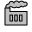

# Icons
SVG icons (only a few made as needed)

  

The icons are not created using a vector graphics design program like Illustrator, but are written directly in code with an editor. They are not cluttered and have a small footprint. Anyone can use them. They will suit especially if you are writing SVG code by hand. Curves are not a buch of points connected through straight lines but true curves. There are no hidden lines, so the icons will also work with `fill: none;`. The coordinates zero point is in the middle, so it's easier to center them when transforming/translating.
